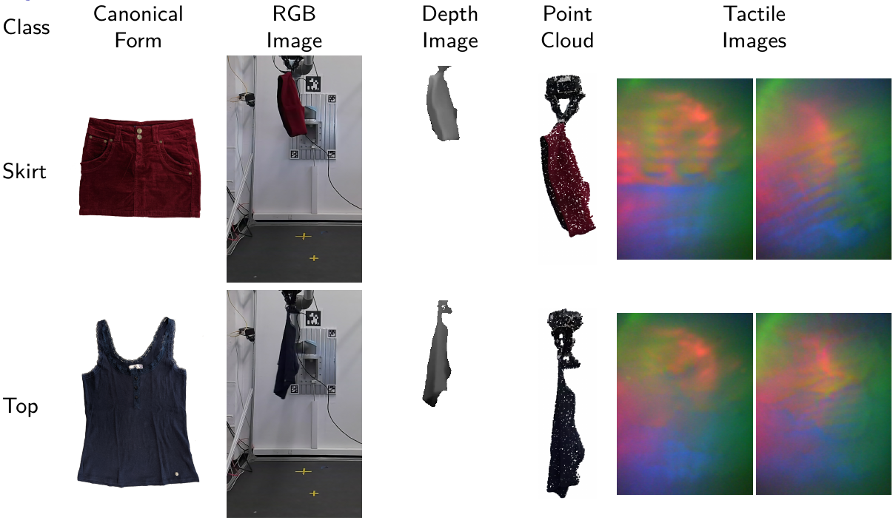
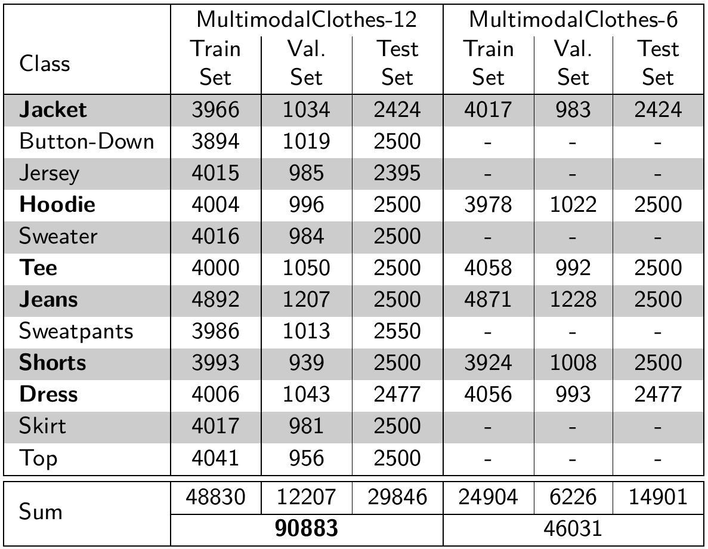
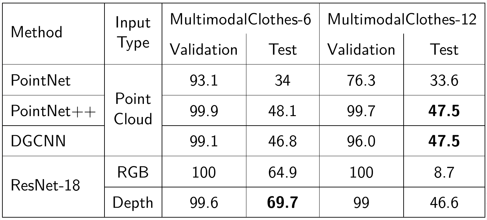

# MultimodalClothes

## Data

The dataset itself will be made available to download soon. 

We provide multimodal recordings of pieces of clothing grasped and rotated by a robot arm. 

### Statistics

## Code 

In the code directory, all of the code used for training, testing and data selection and preprocessing can be found. 
The code used in this work is a heavily modified version of the following repository: https://github.com/yanx27/Pointnet_Pointnet2_pytorch .
We thank the contributors for publishing their work.

## Benchmark performance

We evaluate common architectures (the code of which is included in this repository) on our dataset with the following results: 

